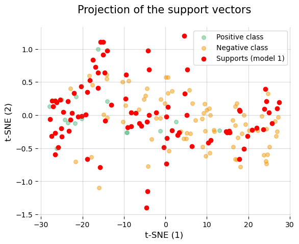
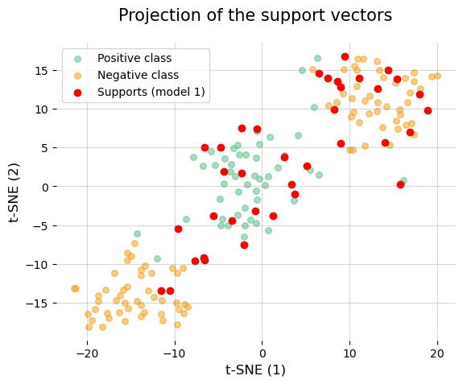

**Model evaluation by cross validation**
========================================

This example shows a basic use case when developing Machine Learning
models, the estimation of the generalization capacity of the model. This
example uses the toy Wine dataset to perform the tests. It is a super
simple dataset but for purposes of showing the basic operation of the
module it serves its purpose.

**Why cross-validation?**

Cross-validation is crucial in evaluating machine learning models
because it provides a more reliable estimate of the model’s performance.
Here’s a brief explanation:

1. Robust Performance Evaluation: Cross-validation involves splitting
   the dataset into multiple subsets and training the model multiple
   times, each time using a different subset as the validation set. This
   ensures that the model is tested on various data points, leading to a
   more accurate assessment of its generalization ability.

2. Reduced Overfitting: By evaluating the model on different splits of
   the data, cross-validation helps detect overfitting. A model that
   performs well on one particular split but poorly on others is likely
   overfitting to the training data.

3. Better Use of Data: Cross-validation makes efficient use of the
   available data, especially in cases where the dataset is limited. By
   rotating the training and validation sets, it ensures that every data
   point is used for both training and validation, providing a
   comprehensive evaluation.

4. Model Selection: It aids in model selection and hyperparameter
   tuning. By comparing performance across different models or
   hyperparameter settings using cross-validation, one can choose the
   best-performing model or configuration with greater confidence.

.. code:: python

    import pandas as pd
    import matplotlib.pyplot as plt
    from sklearn import datasets
    from sklearn.svm import SVC
    from sklearn.preprocessing import StandardScaler
    from sklearn.manifold import TSNE

    # for a simpler use, we load the different submodules of the library
    #     - the gojo.core module contains all the subroutines used to evaluate the models
    #     - the gojo.interfaces module provides a standardized way to interact with the different elements of gojo.core
    #     - the gojo.util module implements some utilities
    from gojo import core
    from gojo import interfaces
    from gojo import util

.. parsed-literal::

    C:\Users\fgarcia\anaconda3\envs\mlv0\lib\site-packages\tqdm\auto.py:21: TqdmWarning: IProgress not found. Please update jupyter and ipywidgets. See https://ipywidgets.readthedocs.io/en/stable/user_install.html
      from .autonotebook import tqdm as notebook_tqdm

The Wine dataset is a classic dataset used in machine learning for
classification tasks. It contains data on various chemical properties of
wines derived from three different cultivars of grapes. Here is a brief
description of the typical Wine dataset:

**Purpose**: The Wine dataset is primarily used for classification
tasks, where the goal is to predict the class of wine (cultivar) based
on its chemical properties.

**Features**: The dataset includes 13 continuous features, which are:

-  Alcohol
-  Malic acid
-  Ash
-  Alcalinity of ash
-  Magnesium
-  Total phenols
-  Flavanoids
-  Nonflavanoid phenols
-  Proanthocyanins
-  Color intensity
-  Hue
-  OD280/OD315 of diluted wines
-  Proline

**Target Variable**: The target variable is the class label, which
indicates the cultivar of the wine. There are three classes:

-  Class 1
-  Class 2
-  Class 3

**Sample Size**: The dataset consists of 178 instances.

**Source**: The dataset was created by M. Forina, et al. and is often
referenced in the UCI Machine Learning Repository.

.. code:: python

    # load test dataset (Wine)
    wine_dt = datasets.load_wine()

    # create the target variable. Classification problem 0 vs rest
    # to see the target names you can use wine_dt['target_names']
    y = (wine_dt['target'] == 1).astype(int)
    X = wine_dt['data']

    X.shape, y.shape

.. parsed-literal::

    ((178, 13), (178,))

**Definition and evaluation of a Support Vector Machine (SVM) model**
---------------------------------------------------------------------

In this case we will go naive to define a model based on support vector
machines (SVM) using a polynomial kernel in a straightforward way
(without any data processing).

**Understanding SVMs with Polynomial Kernels**
~~~~~~~~~~~~~~~~~~~~~~~~~~~~~~~~~~~~~~~~~~~~~~

   **This introduction to SVMs can be skipped**

**Introduction to SVM**
^^^^^^^^^^^^^^^^^^^^^^^

Support Vector Machines are a powerful set of supervised learning
algorithms used for classification and regression tasks. The core idea
behind SVMs is to find a hyperplane that best separates the data points
of different classes in a high-dimensional space.

**The Mathematical Foundation - Hyperplane**
^^^^^^^^^^^^^^^^^^^^^^^^^^^^^^^^^^^^^^^^^^^^

In a binary classification problem, an SVM aims to find the optimal
hyperplane that separates the data points into two classes. A hyperplane
in an (n)-dimensional space is defined by the equation:

.. math::  \mathbf{w} \cdot \mathbf{x} + b = 0

where: - :math:`\mathbf{w}` is the weight vector perpendicular to the
hyperplane. - :math:`\mathbf{x}` is the feature vector. - :math:`b` is
the bias term.

**The Mathematical Foundation - Maximizing the Margin**
^^^^^^^^^^^^^^^^^^^^^^^^^^^^^^^^^^^^^^^^^^^^^^^^^^^^^^^

The objective of an SVM is to maximize the margin, which is the distance
between the hyperplane and the nearest data points from each class.
These nearest points are called support vectors. The margin :math:`M` is
given by:

.. math::  M = \frac{2}{\|\mathbf{w}\|}

Maximizing the margin is equivalent to minimizing $
\|:raw-latex:`\mathbf{w}`\|^2 $, subject to the constraint that all data
points are correctly classified:

.. math::  y_i (\mathbf{w} \cdot \mathbf{x}_i + b) \geq 1

for all :math:`i`, where $ y_i $ is the class label of $
:raw-latex:`\mathbf{x}`\_i $.

**The Mathematical Foundation - The Optimization Problem**
^^^^^^^^^^^^^^^^^^^^^^^^^^^^^^^^^^^^^^^^^^^^^^^^^^^^^^^^^^

This leads to the following optimization problem:

Minimize:

.. math::  \frac{1}{2} \|\mathbf{w}\|^2

Subject to:

.. math::  y_i (\mathbf{w} \cdot \mathbf{x}_i + b) \geq 1

**The Mathematical Foundation - Introducing Kernels**
^^^^^^^^^^^^^^^^^^^^^^^^^^^^^^^^^^^^^^^^^^^^^^^^^^^^^

In many cases, the data is not linearly separable in the original
feature space. SVMs address this by using kernel functions to map the
data into a higher-dimensional space where it becomes linearly
separable. One common kernel is the polynomial kernel.

-  Polynomial Kernel

The polynomial kernel allows the SVM to fit non-linear decision
boundaries. It is defined as:

.. math::  K(\mathbf{x}_i, \mathbf{x}_j) = (\mathbf{x}_i \cdot \mathbf{x}_j + c)^d

where: - :math:`(\mathbf{x}_i \cdot \mathbf{x}_j)` is the dot product of
the input vectors. - $ c $ is a constant that trades off the influence
of higher-order versus lower-order terms. - $ d $ is the degree of the
polynomial.

-  How It Works

1. **Mapping to Higher Dimensions**: The polynomial kernel maps the
   input features into a higher-dimensional space without explicitly
   computing the coordinates in that space. This is computationally
   efficient and allows the SVM to find complex decision boundaries.

2. **Dual Formulation**: The SVM problem can be solved in its dual form,
   where the optimization problem depends on the dot products of the
   input vectors. The polynomial kernel replaces these dot products,
   effectively transforming the problem into a higher-dimensional space.

-  The Dual Optimization Problem

Using the polynomial kernel, the dual form of the optimization problem
becomes:

Maximize:

.. math::  \sum_{i=1}^{n} \alpha_i - \frac{1}{2} \sum_{i=1}^{n} \sum_{j=1}^{n} \alpha_i \alpha_j y_i y_j K(\mathbf{x}_i, \mathbf{x}_j)

Subject to:

.. math::  \sum_{i=1}^{n} \alpha_i y_i = 0

.. math::  0 \leq \alpha_i \leq C

where ( :raw-latex:`\alpha`\_i ) are the Lagrange multipliers and (C) is
a regularization parameter that controls the trade-off between
maximizing the margin and minimizing the classification error.

Support Vector Machines with polynomial kernels are a powerful tool for
classification tasks, especially when dealing with non-linear data. By
transforming the input space into a higher-dimensional feature space,
SVMs can find complex decision boundaries that separate the classes
effectively. The polynomial kernel is particularly useful for capturing
interactions between features up to a certain degree, making SVMs a
versatile choice for many machine learning problems.

**Hands-on**
~~~~~~~~~~~~

In order for the sklearn SVM model to be used in gojo we can use the
**SklearnModelWrapper** interface.

This class simply needs to be provided with the class of a sklearn model
(or any other class that is a subclass of
**sklearn.base.BaseEstimator**), and then optional parameters used to
initialize instances of the class provided in *model_class*.

   for more information use **help(interfaces.SklearnModelWrapper)**

.. code:: python

    model = interfaces.SklearnModelWrapper(
        model_class=SVC,
        kernel='poly', degree=1, coef0=0.0,
        cache_size=1000, class_weight=None
    )
    model

.. parsed-literal::

    SklearnModelWrapper(
        base_model='sklearn.svm._classes.SVC',
        model_params={'kernel': 'poly', 'degree': 1, 'coef0': 0.0, 'cache_size': 1000, 'class_weight': None},
        predict_proba=False,
        supress_warnings=False
    )

.. code:: python

    # to access a dictionary with the parameters provided to the model
    model.getParameters()

.. parsed-literal::

    {'kernel': 'poly',
     'degree': 1,
     'coef0': 0.0,
     'cache_size': 1000,
     'class_weight': None}

Let’s try some inference without having trained the model yet.

.. code:: python

    try:
        model.performInference(X)
    except Exception as ex:
        print(type(ex), ex)

.. parsed-literal::

    <class 'gojo.exception.UnfittedEstimator'> Before making inferences through a model by calling the "performInferences()" method, it is necessary to adjust the model by calling the "train()" method.

In this case we get an exception indicating that before making
inferences the model must be adjusted. To do this let’s call the method
train

.. code:: python

    model.train(X, y)
    y_hat = model.performInference(X)

.. code:: python

    y_hat

.. parsed-literal::

    array([0, 0, 0, 0, 0, 0, 0, 0, 0, 0, 0, 0, 0, 0, 0, 0, 0, 0, 0, 0, 0, 0,
           0, 0, 0, 0, 0, 0, 0, 0, 0, 0, 0, 0, 0, 0, 0, 0, 0, 0, 0, 0, 0, 0,
           0, 0, 0, 0, 0, 0, 0, 0, 0, 0, 0, 0, 0, 0, 0, 1, 0, 1, 0, 1, 1, 0,
           1, 1, 0, 0, 0, 1, 1, 0, 0, 1, 1, 1, 0, 1, 1, 0, 0, 1, 1, 1, 1, 1,
           0, 1, 1, 1, 1, 1, 1, 0, 0, 1, 0, 1, 0, 1, 1, 1, 0, 1, 1, 1, 1, 0,
           1, 1, 1, 1, 1, 1, 1, 1, 1, 1, 0, 1, 1, 1, 1, 1, 1, 1, 1, 1, 0, 1,
           1, 1, 0, 0, 0, 1, 1, 1, 1, 0, 1, 1, 0, 0, 1, 0, 0, 1, 1, 1, 1, 0,
           0, 0, 1, 0, 0, 1, 1, 0, 1, 0, 1, 1, 0, 0, 0, 0, 1, 1, 0, 0, 0, 0,
           0, 1])

Now let’s make a quick calculation of the model’s accuracy

.. code:: python

    print('Accuracy: {:.2f}%'.format((y_hat == y).mean()*100))

.. parsed-literal::

    Accuracy: 76.40%

If we want to reset the internal state of the model to forget previous
settings we can use the **resetFit** method

.. code:: python

    model.is_fitted

.. parsed-literal::

    True

.. code:: python

    model.resetFit()  # reset previous model fits

.. code:: python

    model.is_fitted

.. parsed-literal::

    False

We see that using a point-blank model without training and testing it on
the same data we can expect an accuracy of 76.40%. Let us now try to
evaluate it by cross-validation. For this we can use the function
**core.evalCrossVal**

   for more information use **help(core.evalCrossVal)**

To evaluate the model we will load a cross validation object using the
gojo utilities module, for example a 5-fold cross validation sklearn
object with class stratification.

   for more information use **help(util.splitter.getCrossValObj)**

.. code:: python

    cv_obj = util.splitter.getCrossValObj(cv=5, repeats=1, stratified=True)
    cv_obj

.. parsed-literal::

    RepeatedStratifiedKFold(n_repeats=1, n_splits=5, random_state=None)

With the data, the model and a way to evaluate the model, a cross
validation can now be performed. The result of calling this function
will be an object of type **gojo.core.CVReport**.

.. code:: python

    cv_report = core.evalCrossVal(
        X=X,
        y=y,
        model=model,
        cv=cv_obj,
    )
    cv_report

.. parsed-literal::

    Performing cross-validation...: 5it [00:00, 987.96it/s]

.. parsed-literal::

    <gojo.core.report.CVReport at 0x26c7351b640>

The class **gojo.core.CVReport** implements some interesting
functionalities, let’s see some of them directly using the code:

.. code:: python

    cv_report.getTestPredictions()  # access to all the predictions made on the test

.. raw:: html

    

    
    <table border="1" class="dataframe">
      <thead>
        <tr style="text-align: right;">
          <th></th>
          <th></th>
          <th>pred_labels</th>
          <th>true_labels</th>
        </tr>
        <tr>
          <th>n_fold</th>
          <th>indices</th>
          <th></th>
          <th></th>
        </tr>
      </thead>
      <tbody>
        <tr>
          <th rowspan="5" valign="top">0</th>
          <th>9</th>
          <td>0</td>
          <td>0</td>
        </tr>
        <tr>
          <th>13</th>
          <td>0</td>
          <td>0</td>
        </tr>
        <tr>
          <th>17</th>
          <td>0</td>
          <td>0</td>
        </tr>
        <tr>
          <th>20</th>
          <td>0</td>
          <td>0</td>
        </tr>
        <tr>
          <th>21</th>
          <td>0</td>
          <td>0</td>
        </tr>
        <tr>
          <th>...</th>
          <th>...</th>
          <td>...</td>
          <td>...</td>
        </tr>
        <tr>
          <th rowspan="5" valign="top">4</th>
          <th>153</th>
          <td>0</td>
          <td>0</td>
        </tr>
        <tr>
          <th>158</th>
          <td>0</td>
          <td>0</td>
        </tr>
        <tr>
          <th>159</th>
          <td>1</td>
          <td>0</td>
        </tr>
        <tr>
          <th>170</th>
          <td>1</td>
          <td>0</td>
        </tr>
        <tr>
          <th>172</th>
          <td>0</td>
          <td>0</td>
        </tr>
      </tbody>
    </table>
    
178 rows × 2 columns

    

By passing it a list of metrics (for example those already defined in
gojo.core.evaluation) we can directly obtain an evaluation of the model.

Note that this list of metrics are instances of the
**gojo.core.Metrics** class.

.. code:: python

    model_performance = cv_report.getScores(core.getDefaultMetrics('binary_classification'), supress_warnings=True)
    model_performance

.. parsed-literal::

    {'test':    accuracy  balanced_accuracy  precision    recall  sensitivity  specificity  \
     0  0.694444           0.685065   0.600000  0.642857     0.642857     0.727273
     1  0.750000           0.730519   0.692308  0.642857     0.642857     0.818182
     2  0.805556           0.804762   0.750000  0.800000     0.800000     0.809524
     3  0.828571           0.833333   0.750000  0.857143     0.857143     0.809524
     4  0.742857           0.738095   0.666667  0.714286     0.714286     0.761905

        negative_predictive_value  f1_score       auc  n_fold
     0                   0.761905  0.620690  0.685065       0
     1                   0.782609  0.666667  0.730519       1
     2                   0.850000  0.774194  0.804762       2
     3                   0.894737  0.800000  0.833333       3
     4                   0.800000  0.689655  0.738095       4  ,
     'train': None}

We see that this returns a dictionary of dataframes. In this case the
dictionary only has one key which is test.

.. code:: python

    model_performance['test']

.. raw:: html

    

    
    <table border="1" class="dataframe">
      <thead>
        <tr style="text-align: right;">
          <th></th>
          <th>accuracy</th>
          <th>balanced_accuracy</th>
          <th>precision</th>
          <th>recall</th>
          <th>sensitivity</th>
          <th>specificity</th>
          <th>negative_predictive_value</th>
          <th>f1_score</th>
          <th>auc</th>
          <th>n_fold</th>
        </tr>
      </thead>
      <tbody>
        <tr>
          <th>0</th>
          <td>0.694444</td>
          <td>0.685065</td>
          <td>0.600000</td>
          <td>0.642857</td>
          <td>0.642857</td>
          <td>0.727273</td>
          <td>0.761905</td>
          <td>0.620690</td>
          <td>0.685065</td>
          <td>0</td>
        </tr>
        <tr>
          <th>1</th>
          <td>0.750000</td>
          <td>0.730519</td>
          <td>0.692308</td>
          <td>0.642857</td>
          <td>0.642857</td>
          <td>0.818182</td>
          <td>0.782609</td>
          <td>0.666667</td>
          <td>0.730519</td>
          <td>1</td>
        </tr>
        <tr>
          <th>2</th>
          <td>0.805556</td>
          <td>0.804762</td>
          <td>0.750000</td>
          <td>0.800000</td>
          <td>0.800000</td>
          <td>0.809524</td>
          <td>0.850000</td>
          <td>0.774194</td>
          <td>0.804762</td>
          <td>2</td>
        </tr>
        <tr>
          <th>3</th>
          <td>0.828571</td>
          <td>0.833333</td>
          <td>0.750000</td>
          <td>0.857143</td>
          <td>0.857143</td>
          <td>0.809524</td>
          <td>0.894737</td>
          <td>0.800000</td>
          <td>0.833333</td>
          <td>3</td>
        </tr>
        <tr>
          <th>4</th>
          <td>0.742857</td>
          <td>0.738095</td>
          <td>0.666667</td>
          <td>0.714286</td>
          <td>0.714286</td>
          <td>0.761905</td>
          <td>0.800000</td>
          <td>0.689655</td>
          <td>0.738095</td>
          <td>4</td>
        </tr>
      </tbody>
    </table>
    

From here it is easy to calculate the average cross-validation
performance. Let’s format the result a bit…

.. code:: python

    pd.DataFrame(model_performance['test'].mean(), columns=['Performance']).drop(index=['n_fold']).round(decimals=3)

.. raw:: html

    

    
    <table border="1" class="dataframe">
      <thead>
        <tr style="text-align: right;">
          <th></th>
          <th>Performance</th>
        </tr>
      </thead>
      <tbody>
        <tr>
          <th>accuracy</th>
          <td>0.764</td>
        </tr>
        <tr>
          <th>balanced_accuracy</th>
          <td>0.758</td>
        </tr>
        <tr>
          <th>precision</th>
          <td>0.692</td>
        </tr>
        <tr>
          <th>recall</th>
          <td>0.731</td>
        </tr>
        <tr>
          <th>sensitivity</th>
          <td>0.731</td>
        </tr>
        <tr>
          <th>specificity</th>
          <td>0.785</td>
        </tr>
        <tr>
          <th>negative_predictive_value</th>
          <td>0.818</td>
        </tr>
        <tr>
          <th>f1_score</th>
          <td>0.710</td>
        </tr>
        <tr>
          <th>auc</th>
          <td>0.758</td>
        </tr>
      </tbody>
    </table>
    

Let’s see which metrics are implemented…

.. code:: python

    core.getAvailableDefaultMetrics()

.. parsed-literal::

    {'binary_classification': ['accuracy',
      'balanced_accuracy',
      'precision',
      'recall',
      'sensitivity',
      'specificity',
      'npv',
      'f1_score',
      'auc'],
     'regression': ['explained_variance',
      'mse',
      'mae',
      'r2_score',
      'pearson_correlation']}

.. code:: python

    core.getDefaultMetrics('binary_classification')[:2]

.. parsed-literal::

    [Metric(
         name=accuracy,
         function_kw={},
         multiclass=False
     ),
     Metric(
         name=balanced_accuracy,
         function_kw={},
         multiclass=False
     )]

.. code:: python

    core.getDefaultMetrics('regression')[:2]

.. parsed-literal::

    [Metric(
         name=explained_variance,
         function_kw={},
         multiclass=False
     ),
     Metric(
         name=mse,
         function_kw={},
         multiclass=False
     )]

Now, what if I also want to access the training predictions? By default
the predictions on the data used for training are not calculated. The
rationale of this is to avoid unnecessary calculations when they are not
required. However, we can specify that we want to apply the model on the
training data used in each fold of the cross validation and save the
results of the predictions by calling **core.evalCrossVal** via
**save_train_preds=True**.

Similarly, it is also possible to keep a copy of all the models trained
in each of the folds by means of the parameter **save_models** (by
default this parameter is False).

   Here it should be noted that keeping a copy of the models implies a
   higher memory usage (similar to keeping a copy of the predictions on
   the training set).

.. code:: python

    cv_report_2 = core.evalCrossVal(
        X=X,
        y=y,
        model=model,
        cv=cv_obj,
        save_train_preds=True,
        save_models=True
    )
    cv_report_2

.. parsed-literal::

    Performing cross-validation...: 5it [00:00, 822.77it/s]

.. parsed-literal::

    <gojo.core.report.CVReport at 0x26c591a3f10>

.. code:: python

    cv_report_2.getTrainPredictions()  # access to all the predictions made on the train

.. raw:: html

    

    
    <table border="1" class="dataframe">
      <thead>
        <tr style="text-align: right;">
          <th></th>
          <th></th>
          <th>pred_labels</th>
          <th>true_labels</th>
        </tr>
        <tr>
          <th>n_fold</th>
          <th>indices</th>
          <th></th>
          <th></th>
        </tr>
      </thead>
      <tbody>
        <tr>
          <th rowspan="5" valign="top">0</th>
          <th>0</th>
          <td>0</td>
          <td>0</td>
        </tr>
        <tr>
          <th>1</th>
          <td>0</td>
          <td>0</td>
        </tr>
        <tr>
          <th>2</th>
          <td>0</td>
          <td>0</td>
        </tr>
        <tr>
          <th>3</th>
          <td>0</td>
          <td>0</td>
        </tr>
        <tr>
          <th>4</th>
          <td>0</td>
          <td>0</td>
        </tr>
        <tr>
          <th>...</th>
          <th>...</th>
          <td>...</td>
          <td>...</td>
        </tr>
        <tr>
          <th rowspan="5" valign="top">4</th>
          <th>171</th>
          <td>1</td>
          <td>0</td>
        </tr>
        <tr>
          <th>174</th>
          <td>0</td>
          <td>0</td>
        </tr>
        <tr>
          <th>175</th>
          <td>0</td>
          <td>0</td>
        </tr>
        <tr>
          <th>176</th>
          <td>0</td>
          <td>0</td>
        </tr>
        <tr>
          <th>177</th>
          <td>1</td>
          <td>0</td>
        </tr>
      </tbody>
    </table>
    
712 rows × 2 columns

    

.. code:: python

    cv_report_2.getTrainedModels()   # It is also easy to access each of the models trained in each of the folds

.. parsed-literal::

    {0: SklearnModelWrapper(
         base_model='sklearn.svm._classes.SVC',
         model_params={'kernel': 'poly', 'degree': 1, 'coef0': 0.0, 'cache_size': 1000, 'class_weight': None},
         predict_proba=False,
         supress_warnings=False
     ),
     1: SklearnModelWrapper(
         base_model='sklearn.svm._classes.SVC',
         model_params={'kernel': 'poly', 'degree': 1, 'coef0': 0.0, 'cache_size': 1000, 'class_weight': None},
         predict_proba=False,
         supress_warnings=False
     ),
     2: SklearnModelWrapper(
         base_model='sklearn.svm._classes.SVC',
         model_params={'kernel': 'poly', 'degree': 1, 'coef0': 0.0, 'cache_size': 1000, 'class_weight': None},
         predict_proba=False,
         supress_warnings=False
     ),
     3: SklearnModelWrapper(
         base_model='sklearn.svm._classes.SVC',
         model_params={'kernel': 'poly', 'degree': 1, 'coef0': 0.0, 'cache_size': 1000, 'class_weight': None},
         predict_proba=False,
         supress_warnings=False
     ),
     4: SklearnModelWrapper(
         base_model='sklearn.svm._classes.SVC',
         model_params={'kernel': 'poly', 'degree': 1, 'coef0': 0.0, 'cache_size': 1000, 'class_weight': None},
         predict_proba=False,
         supress_warnings=False
     )}

We can now calculate the same metrics as before on the test data and the
training data to see how the model behaves.

.. code:: python

    model_performance_2 = cv_report_2.getScores(core.getDefaultMetrics('binary_classification'), supress_warnings=True)
    model_performance_2

.. parsed-literal::

    {'test':    accuracy  balanced_accuracy  precision    recall  sensitivity  specificity  \
     0  0.805556           0.788961   0.769231  0.714286     0.714286     0.863636
     1  0.666667           0.688312   0.550000  0.785714     0.785714     0.590909
     2  0.777778           0.761905   0.769231  0.666667     0.666667     0.857143
     3  0.857143           0.880952   0.736842  1.000000     1.000000     0.761905
     4  0.771429           0.750000   0.750000  0.642857     0.642857     0.857143

        negative_predictive_value  f1_score       auc  n_fold
     0                   0.826087  0.740741  0.788961       0
     1                   0.812500  0.647059  0.688312       1
     2                   0.782609  0.714286  0.761905       2
     3                   1.000000  0.848485  0.880952       3
     4                   0.782609  0.692308  0.750000       4  ,
     'train':    accuracy  balanced_accuracy  precision    recall  sensitivity  specificity  \
     0  0.746479           0.742002   0.672131  0.719298     0.719298     0.764706
     1  0.795775           0.794737   0.725806  0.789474     0.789474     0.800000
     2  0.760563           0.761836   0.671875  0.767857     0.767857     0.755814
     3  0.755245           0.752142   0.677419  0.736842     0.736842     0.767442
     4  0.769231           0.763770   0.700000  0.736842     0.736842     0.790698

        negative_predictive_value  f1_score       auc  n_fold
     0                   0.802469  0.694915  0.742002       0
     1                   0.850000  0.756303  0.794737       1
     2                   0.833333  0.716667  0.761836       2
     3                   0.814815  0.705882  0.752142       3
     4                   0.819277  0.717949  0.763770       4  }

We see that the model behaves similarly in training and testing which is
indicating that the model is not overfitting (**we will see later what
is actually happening since the model performing poorly**).

.. code:: python

    pd.concat([
        pd.DataFrame(model_performance_2['test'].mean(), columns=['Performance (test)']).drop(index=['n_fold']).round(decimals=3),
        pd.DataFrame(model_performance_2['train'].mean(), columns=['Performance (train)']).drop(index=['n_fold']).round(decimals=3)

    ], axis=1)

.. raw:: html

    

    
    <table border="1" class="dataframe">
      <thead>
        <tr style="text-align: right;">
          <th></th>
          <th>Performance (test)</th>
          <th>Performance (train)</th>
        </tr>
      </thead>
      <tbody>
        <tr>
          <th>accuracy</th>
          <td>0.776</td>
          <td>0.765</td>
        </tr>
        <tr>
          <th>balanced_accuracy</th>
          <td>0.774</td>
          <td>0.763</td>
        </tr>
        <tr>
          <th>precision</th>
          <td>0.715</td>
          <td>0.689</td>
        </tr>
        <tr>
          <th>recall</th>
          <td>0.762</td>
          <td>0.750</td>
        </tr>
        <tr>
          <th>sensitivity</th>
          <td>0.762</td>
          <td>0.750</td>
        </tr>
        <tr>
          <th>specificity</th>
          <td>0.786</td>
          <td>0.776</td>
        </tr>
        <tr>
          <th>negative_predictive_value</th>
          <td>0.841</td>
          <td>0.824</td>
        </tr>
        <tr>
          <th>f1_score</th>
          <td>0.729</td>
          <td>0.718</td>
        </tr>
        <tr>
          <th>auc</th>
          <td>0.774</td>
          <td>0.763</td>
        </tr>
      </tbody>
    </table>
    

Furthremore, let’s take advantage of the fact that we have saved the
models to take a look at the different support vectors.

.. code:: python

    # First, let's make a two-dimensional projection of the data to facilitate visualization.
    tsne_projection = TSNE(n_components=2, perplexity=20, random_state=2024).fit_transform(X)
    tsne_projection = pd.DataFrame(tsne_projection, columns=['emb_1', 'emb_2'])

.. code:: python

    trained_models = cv_report_2.getTrainedModels()

.. code:: python

    trained_models[0].model.support_

.. parsed-literal::

    array([  4,  15,  16,  18,  31,  32,  34, 103, 104, 105, 106, 107, 108,
           109, 110, 111, 112, 114, 115, 116, 117, 118, 119, 120, 121, 122,
           123, 125, 126, 127, 128, 129, 130, 131, 132, 133, 134, 135, 136,
           137, 138, 139, 141,  46,  47,  48,  49,  50,  52,  53,  54,  55,
            56,  57,  58,  59,  60,  62,  63,  65,  66,  67,  68,  69,  70,
            71,  72,  73,  74,  77,  78,  79,  81,  82,  83,  85,  86,  88,
            89,  90,  91,  93,  94,  96,  97, 102])

.. code:: python

    fig, ax = plt.subplots()

    ax.scatter(
        tsne_projection.loc[y == 1]['emb_1'].values,
        tsne_projection.loc[y == 1]['emb_2'].values,
        color='#52BE80',
        label='Positive class',
        alpha=0.5, s=30
    )

    ax.scatter(
        tsne_projection.loc[y == 0]['emb_1'].values,
        tsne_projection.loc[y == 0]['emb_2'].values,
        color='#F39C12',
        label='Negative class',
        alpha=0.5, s=30
    )

    # access to the support vectors of the first model
    ax.scatter(
        tsne_projection.iloc[trained_models[0].model.support_]['emb_1'].values,
        tsne_projection.iloc[trained_models[0].model.support_]['emb_2'].values,
        color='red',
        label='Supports (model 1)',
    )

    for pos in ['top', 'right', 'left', 'bottom']:
        ax.spines[pos].set_visible(False)

    ax.grid(alpha=0.3, color='grey')
    ax.set_ylabel('t-SNE (2)', size=12)
    ax.set_xlabel('t-SNE (1)', size=12)
    ax.set_title('Projection of the support vectors', size=15, pad=20)
    ax.legend()
    plt.show()

No doubt something strange is going on with the data… what could it be?
**THAT WE HAVE FORGOTTEN TO STANDARDIZE THEM!!!**

To standardize the data during cross validation using the statistics of
the training data to prevent any data leakage we can make use of the
**interfaces.SKLearnTransformWrapper** interface. Let us now look at the
above example by standardizing the data to z-scores based on the
training statistics.

   **Note**: any type of transformation can be implemented through the
   **interfaces.Transform** or **interfaces.SKLearnTransformWrapper**
   interfaces (e.g. a feature selection or any other type of
   transformation).

.. code:: python

    zscores_scaler = interfaces.SKLearnTransformWrapper(transform_class=StandardScaler)
    zscores_scaler

.. parsed-literal::

    SKLearnTransformWrapper(
        base_transform='sklearn.preprocessing._data.StandardScaler',
        transform_params={}
    )

.. code:: python

    cv_report_3 = core.evalCrossVal(
        X=X,
        y=y,
        model=model,
        cv=cv_obj,
        save_train_preds=True,
        save_models=True,
        transforms=[zscores_scaler]     # we can provide he transforms using the `transform` parameter
    )
    cv_report_3

.. parsed-literal::

    Performing cross-validation...: 5it [00:00, 830.52it/s]

.. parsed-literal::

    <gojo.core.report.CVReport at 0x26c735cde10>

Let’s recalculate the performance as before…

.. code:: python

    model_performance_3 = cv_report_3.getScores(core.getDefaultMetrics('binary_classification'), supress_warnings=True)
    pd.concat([
        pd.DataFrame(model_performance_3['test'].mean(), columns=['Performance (test)']).drop(index=['n_fold']).round(decimals=3),
        pd.DataFrame(model_performance_3['train'].mean(), columns=['Performance (train)']).drop(index=['n_fold']).round(decimals=3)

    ], axis=1)

.. raw:: html

    

    
    <table border="1" class="dataframe">
      <thead>
        <tr style="text-align: right;">
          <th></th>
          <th>Performance (test)</th>
          <th>Performance (train)</th>
        </tr>
      </thead>
      <tbody>
        <tr>
          <th>accuracy</th>
          <td>0.983</td>
          <td>0.987</td>
        </tr>
        <tr>
          <th>balanced_accuracy</th>
          <td>0.981</td>
          <td>0.984</td>
        </tr>
        <tr>
          <th>precision</th>
          <td>0.985</td>
          <td>1.000</td>
        </tr>
        <tr>
          <th>recall</th>
          <td>0.971</td>
          <td>0.968</td>
        </tr>
        <tr>
          <th>sensitivity</th>
          <td>0.971</td>
          <td>0.968</td>
        </tr>
        <tr>
          <th>specificity</th>
          <td>0.991</td>
          <td>1.000</td>
        </tr>
        <tr>
          <th>negative_predictive_value</th>
          <td>0.983</td>
          <td>0.980</td>
        </tr>
        <tr>
          <th>f1_score</th>
          <td>0.978</td>
          <td>0.984</td>
        </tr>
        <tr>
          <th>auc</th>
          <td>0.981</td>
          <td>0.984</td>
        </tr>
      </tbody>
    </table>
    

As you can see now if we have a good performance, it is very important
that for distance-based models such as SVMs we **standardize the
data!!!**

Let’s represent again the support vectors of the first model…

.. code:: python

    # access to trained models
    trained_models = cv_report_3.getTrainedModels()
    
    # standardization of all data to z-scores to recalculate the t-SNE projection
    zscores_scaler.fit(X)
    zscores_X = zscores_scaler.transform(X)
    tsne_projection = TSNE(n_components=2, perplexity=20, random_state=2024).fit_transform(zscores_X)
    tsne_projection = pd.DataFrame(tsne_projection, columns=['emb_1', 'emb_2'])
    
    fig, ax = plt.subplots()
    
    ax.scatter(
        tsne_projection.loc[y == 1]['emb_1'].values,
        tsne_projection.loc[y == 1]['emb_2'].values,
        color='#52BE80',
        label='Positive class',
        alpha=0.5, s=30
    )
    
    ax.scatter(
        tsne_projection.loc[y == 0]['emb_1'].values,
        tsne_projection.loc[y == 0]['emb_2'].values,
        color='#F39C12',
        label='Negative class',
        alpha=0.5, s=30
    )
    
    # access to the support vectors of the first model
    ax.scatter(
        tsne_projection.iloc[trained_models[0].model.support_]['emb_1'].values,
        tsne_projection.iloc[trained_models[0].model.support_]['emb_2'].values,
        color='red',
        label='Supports (model 1)',
    )
    
    for pos in ['top', 'right', 'left', 'bottom']:
        ax.spines[pos].set_visible(False)
        
    ax.grid(alpha=0.3, color='grey')
    ax.set_ylabel('t-SNE (2)', size=12)
    ax.set_xlabel('t-SNE (1)', size=12)
    ax.set_title('Projection of the support vectors', size=15, pad=20)
    ax.legend()
    plt.show()

**We have now been able to see that the support vectors make much more
sense than before, and there are also fewer of them, which is a sign
that the model is not overfitting.**
